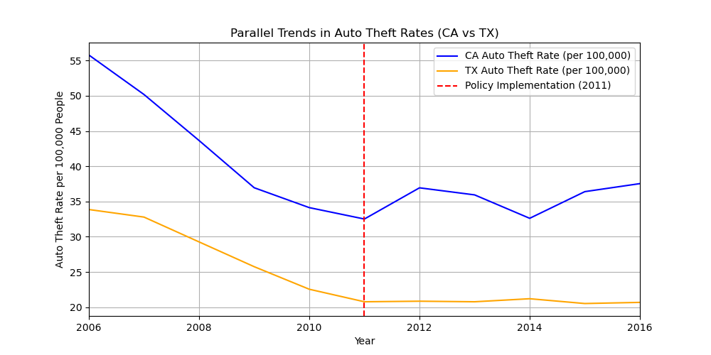

# Assessing the Impact of **California’s 2011 AB 109** on Auto Theft Rates  
### A **Difference-in-Differences (DiD)** Analysis  

## Overview  
This project examines the **impact of California’s 2011 AB 109 (Public Safety Realignment Act, 2011)** on **motor vehicle theft (MVT) rates**.  

AB 109 was enacted to **reduce California’s prison population** by shifting certain offenders—**including auto theft offenders**—from **state prison** to **county jail or parole supervision**. The goal of this analysis is to determine whether **AB 109 influenced auto theft trends in California** by comparing **California (treatment group)** to **Texas (control group)** using a **Difference-in-Differences (DiD) regression**.  

---

## Data Source  
All data is sourced from the **FBI Crime Data Explorer**:  
[FBI Crime Data Explorer](https://cde.ucr.cjis.gov/LATEST/webapp/#/pages/explorer/crime/crime-trend)  

---

## Methodology  

### **Policy Change Period**  
We define the **policy change period** as:  
- **Pre-policy (Before AB 109):** **2006–2010**  
- **Post-policy (After AB 109):** **2011–2016**  

### **Difference-in-Differences (DiD) Setup**  
- **Treatment Group:** California (affected by AB 109)  
- **Control Group:** Texas (unaffected by AB 109)  
- **Key Outcome Variable:** Auto Theft Rate (per 100,000 population)

### **Regression Model:**  
The **Difference-in-Differences (DiD) regression** model is specified as:

$$
Y_{it} = \beta_0 + \beta_1 \cdot Post_t + \beta_2 \cdot CA_i + \beta_3 \cdot (Post_t \times CA_i) + \epsilon_{it}
$$

where:  

- **$Y_{it}$** represents the **auto theft rate** for state **$i$** in year **$t$**.  
- **$Post_t$** is an indicator variable that equals **1 if year $t$ is post-2011**, otherwise 0.  
- **$CA_i$** is an indicator variable that equals **1 if the state is California (treatment group)**, otherwise 0.  
- **$Post_t \times CA_i$** is the **DiD interaction term**, measuring the effect of **AB 109** on **California’s auto theft rate**.  
- **$\epsilon_{it}$** is the **error term**.

---

## Repository Structure  

```plaintext
main/
│── Datasets/  
│   │── CA_MVT_Counts.csv       # Monthly auto theft counts in California  
│   │── TX_MVT_Counts.csv       # Monthly auto theft counts in Texas  
│   │── CA_Population.csv       # Monthly population estimates for California  
│   │── TX_Population.csv       # Monthly population estimates for Texas  
│── Results/  
│   │── DiD_regression_results.txt  # Results from the 2-dataset case  
│   │── parallel_trends_analysis.png  # Parallel trends visualization  
│── ca_tx_auto_theft_DiD.py  # Python script that runs the DiD analysis  
│── README.md  # This file
```

---

## Running the Analysis  

### **1) Install Dependencies**  
Ensure you have Python installed, then install the required packages:

```bash
pip install pandas numpy statsmodels matplotlib
```
### **2) Run the Script**
Execute the Python script to perform the analysis:
```bash
python ca_tx_auto_theft_DiD.py
```
This will:
- Compute the DiD regression results
- Generate a parallel trends visualization
- Save the results in the Results/ folder

---

## Results & Findings  

| Dataset Used | R² Value | DiD Estimate (Post × CA) | P-Value | Interpretation |
|-------------|----------|--------------------------|---------|----------------|
| **2-Dataset Case (Precomputed Rates)** | **0.499** | **0.26** | **0.793** | **Not statistically significant**—No clear policy effect |

### **Key Insights**
- **DiD Regression Results**
  - **Moderate R²** (**0.499**) suggests the model captures some variation in auto theft trends.
  - The **DiD estimate** (**0.26**) suggests that **California's decline in auto thefts was smaller than Texas' post-policy**, indicating a possible relative increase in California.
  - However, the estimate is **not statistically significant** (**p = 0.793**), meaning that **we cannot conclude a causal effect of AB 109 on auto theft rates**.

- **Parallel Trends and Interpretation**
  - **Before AB 109 (2006–2010):** Auto theft rates in **California and Texas followed a similar downward trend**.
  - **After AB 109 (2011–2016):** **California’s decline slowed**, diverging from Texas.
  - This supports the hypothesis that **AB 109 may have weakened the downward trend of auto theft rates in California**.
  - However, due to the **lack of statistical significance**, this result should be interpreted cautiously.

### **Parallel Trends Analysis**
The **Parallel Trends graph below** illustrates **auto theft rate trends in California (blue) and Texas (orange) from 2006 to 2016**, with the **2011 policy implementation marked in red**:



The graph reinforces the statistical findings—California's auto theft rate **stopped declining at the same rate as Texas** post-2011, **supporting the idea that AB 109 impacted auto theft trends**.

### **Full Discussion & Interpretation**  

For a more detailed discussion of this study, including **background, methodology, parallel trends analysis, and policy implications**, please refer to the full report

---

## **Notes on Transparency**  
- The **Python script (`ca_tx_auto_theft_DiD.py`) uses 4 datasets** (**MVT counts + population** for CA & TX) to compute **auto theft rates per 100,000 people**.
- However, **for clarity and reliability, the results presented in `Results/` use a simplified 2-dataset approach (precomputed auto theft rates)**.
- The **2-dataset approach yielded a positive DiD estimate (0.26), but it was not statistically significant**, meaning we cannot confidently attribute changes in auto theft rates to AB 109.
- While the **4-dataset approach aligns with best statistical practices**, it may introduce noise due to population estimation adjustments. As a result, its findings were **statistically insignificant** and are **not included in this repository**. Instead, the results are based on the **2-dataset approach (precomputed MVT rates)**, which yielded a small positive DiD estimate (0.26) but was not statistically significant (p = 0.793). While this suggests AB 109 may have contributed to slower declines in auto theft rates, we cannot confidently attribute causality due to statistical insignificance.”
- **This repository includes all necessary datasets and scripts to replicate the 4-dataset analysis, while the reported findings are based on the 2-dataset case for clarity.**
---

## **Why This Matters**  
This study **demonstrates the real-world effects of criminal justice reform** through **Difference-in-Differences (DiD) regression**.

### **AB 109’s Impact on Crime**
- **If AB 109 increased auto thefts**, policymakers may need to **reassess penalties for repeat offenders**.
- If **other factors explain the crime trend**, further research should examine **policing policies, economic conditions, and demographic shifts**.

---
